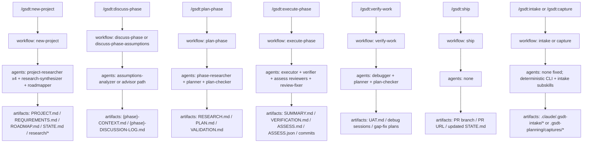

# GSDT Architecture

> System architecture for contributors and advanced users. For user-facing documentation, see [Feature Reference](FEATURES.md) or [User Guide](USER-GUIDE.md).

---

## Table of Contents

- [System Overview](#system-overview)
- [Design Principles](#design-principles)
- [Component Architecture](#component-architecture)
- [Agent Model](#agent-model)
- [Data Flow](#data-flow)
- [File System Layout](#file-system-layout)
- [Installer Architecture](#installer-architecture)
- [Hook System](#hook-system)
- [CLI Tools Layer](#cli-tools-layer)
- [Runtime Abstraction](#runtime-abstraction)

---

## System Overview

GSDT is a **meta-prompting framework** that sits between the user and AI coding agents (Claude Code, Gemini CLI, OpenCode, Codex, Copilot, Antigravity). It provides:

1. **Context engineering** — Structured artifacts that give the AI everything it needs per task
2. **Multi-agent orchestration** — Thin orchestrators that spawn specialized agents with fresh context windows
3. **Spec-driven development** — Requirements → research → plans → execution → verification pipeline
4. **State management** — Persistent project memory across sessions and context resets

```
┌──────────────────────────────────────────────────────┐
│                      USER                            │
│            /gsdt:command [args]                        │
└─────────────────────┬────────────────────────────────┘
                      │
┌─────────────────────▼────────────────────────────────┐
│              COMMAND LAYER                            │
│   commands/gsdt/*.md — Prompt-based command files      │
│   (Claude Code custom commands / Codex skills)        │
└─────────────────────┬────────────────────────────────┘
                      │
┌─────────────────────▼────────────────────────────────┐
│              WORKFLOW LAYER                           │
│   gsdt/workflows/*.md — Orchestration logic  │
│   (Reads references, spawns agents, manages state)    │
└──────┬──────────────┬─────────────────┬──────────────┘
       │              │                 │
┌──────▼──────┐ ┌─────▼─────┐ ┌────────▼───────┐
│  AGENT      │ │  AGENT    │ │  AGENT         │
│  (fresh     │ │  (fresh   │ │  (fresh        │
│   context)  │ │   context)│ │   context)     │
└──────┬──────┘ └─────┬─────┘ └────────┬───────┘
       │              │                 │
┌──────▼──────────────▼─────────────────▼──────────────┐
│              CLI TOOLS LAYER                          │
│   gsdt/bin/gsdt-tools.cjs                     │
│   (State, config, phase, roadmap, verify, templates)  │
└──────────────────────┬───────────────────────────────┘
                       │
┌──────────────────────▼───────────────────────────────┐
│              FILE SYSTEM (.claude/.gsdt-planning/)                 │
│   PROJECT.md | REQUIREMENTS.md | ROADMAP.md          │
│   STATE.md | config.json | phases/ | research/       │
└──────────────────────────────────────────────────────┘
```

## End-To-End Command Map

The most common production path is easiest to understand as a `command -> workflow -> agent -> artifact` chain:



---

## Design Principles

### 1. Fresh Context Per Agent

Every agent spawned by an orchestrator gets a clean context window (up to 200K tokens). This eliminates context rot — the quality degradation that happens as an AI fills its context window with accumulated conversation.

### 2. Thin Orchestrators

Workflow files (`gsdt/workflows/*.md`) never do heavy lifting. They:
- Load context via `gsdt-tools.cjs init <workflow>`
- Spawn specialized agents with focused prompts
- Collect results and route to the next step
- Update state between steps

### 3. File-Based State

All state lives in `.claude/.gsdt-planning/` as human-readable Markdown and JSON. No database, no server, no external dependencies. This means:
- State survives context resets (`/clear`)
- State is inspectable by both humans and agents
- State can be committed to git for team visibility

### 4. Absent = Enabled

Workflow feature flags follow the **absent = enabled** pattern. If a key is missing from `config.json`, it defaults to `true`. Users explicitly disable features; they don't need to enable defaults.

### 5. Defense in Depth

Multiple layers prevent common failure modes:
- Plans are verified before execution (plan-checker agent)
- Execution produces atomic commits per task
- Post-execution verification checks against phase goals
- UAT provides human verification as final gate

---

## Component Architecture

### Commands (`commands/gsdt/*.md`)

User-facing entry points. Each file contains YAML frontmatter (name, description, allowed-tools) and a prompt body that bootstraps the workflow. Commands are installed as:
- **Claude Code:** Custom slash commands (`/gsdt:command-name`)
- **OpenCode:** Slash commands (`/gsd-command-name`)
- **Codex:** Skills (`$gsd-command-name`)
- **Copilot:** Slash commands (`/gsdt:command-name`)
- **Antigravity:** Skills

**Total commands:** 65

### Workflows (`gsdt/workflows/*.md`)

Orchestration logic that commands reference. Contains the step-by-step process including:
- Context loading via `gsdt-tools.cjs init`
- Agent spawn instructions with model resolution
- Gate/checkpoint definitions
- State update patterns
- Error handling and recovery

**Total workflows:** 66

### Agents (`agents/*.md`)

Specialized agent definitions with frontmatter specifying:
- `name` — Agent identifier
- `description` — Role and purpose
- `tools` — Allowed tool access (Read, Write, Edit, Bash, Grep, Glob, WebSearch, etc.)
- `color` — Terminal output color for visual distinction

**Total agents:** 30

### References (`gsdt/references/*.md`)

Shared knowledge documents that workflows and agents `@-reference`:
- `checkpoints.md` — Checkpoint type definitions and interaction patterns
- `model-profiles.md` — Per-agent model tier assignments
- `verification-patterns.md` — How to verify different artifact types
- `planning-config.md` — Full config schema and behavior
- `git-integration.md` — Git commit, branching, and history patterns
- `questioning.md` — Dream extraction philosophy for project initialization
- `tdd.md` — Test-driven development integration patterns
- `ui-brand.md` — Visual output formatting patterns

### Templates (`gsdt/templates/`)

Markdown templates for all planning artifacts. Used by `gsdt-tools.cjs template fill` and `scaffold` commands to create pre-structured files:
- `project.md`, `requirements.md`, `roadmap.md`, `state.md` — Core project files
- `phase-prompt.md` — Phase execution prompt template
- `summary.md` (+ `summary-minimal.md`, `summary-standard.md`, `summary-complex.md`) — Granularity-aware summary templates
- `DEBUG.md` — Debug session tracking template
- `UI-SPEC.md`, `UAT.md`, `VALIDATION.md` — Specialized verification templates
- `discussion-log.md` — Discussion audit trail template
- `codebase/` — Brownfield mapping templates (stack, architecture, conventions, concerns, structure, testing, integrations)
- `research-project/` — Research output templates (SUMMARY, STACK, FEATURES, ARCHITECTURE, PITFALLS)

### Hooks (`hooks/`)

Runtime hooks that integrate with the host AI agent:

| Hook | Event | Purpose |
|------|-------|---------|
| `gsdt-statusline.js` | `statusLine` | Displays model, task, directory, and context usage bar |
| `gsdt-context-monitor.js` | `PostToolUse` / `AfterTool` | Injects agent-facing context warnings at 35%/25% remaining |
| `gsdt-check-update.js` | `SessionStart` | Background check for new GSDT versions |
| `gsdt-prompt-guard.js` | `PreToolUse` | Scans `.claude/.gsdt-planning/` writes for prompt injection patterns (advisory) |
| `gsdt-workflow-guard.js` | `PreToolUse` | Detects file edits outside GSDT workflow context (advisory, opt-in via `hooks.workflow_guard`) |

### CLI Tools (`gsdt/bin/`)

Node.js CLI utility (`gsdt-tools.cjs`) with 17 domain modules:

| Module | Responsibility |
|--------|---------------|
| `core.cjs` | Error handling, output formatting, shared utilities |
| `state.cjs` | STATE.md parsing, updating, progression, metrics |
| `phase.cjs` | Phase directory operations, decimal numbering, plan indexing |
| `roadmap.cjs` | ROADMAP.md parsing, phase extraction, plan progress |
| `config.cjs` | config.json read/write, section initialization |
| `verify.cjs` | Plan structure, phase completeness, reference, commit validation |
| `template.cjs` | Template selection and filling with variable substitution |
| `frontmatter.cjs` | YAML frontmatter CRUD operations |
| `init.cjs` | Compound context loading for each workflow type |
| `milestone.cjs` | Milestone archival, requirements marking |
| `commands.cjs` | Misc commands (slug, timestamp, todos, scaffolding, stats) |
| `model-profiles.cjs` | Model profile resolution table |
| `security.cjs` | Path traversal prevention, prompt injection detection, safe JSON parsing, shell argument validation |
| `uat.cjs` | UAT file parsing, verification debt tracking, audit-uat support |

---

## Agent Model

### Orchestrator → Agent Pattern

```
Orchestrator (workflow .md)
    │
    ├── Load context: gsdt-tools.cjs init <workflow> <phase>
    │   Returns JSON with: project info, config, state, phase details
    │
    ├── Resolve model: gsdt-tools.cjs resolve-model <agent-name>
    │   Returns: opus | sonnet | haiku | inherit
    │
    ├── Spawn Agent (Task/SubAgent call)
    │   ├── Agent prompt (agents/*.md)
    │   ├── Context payload (init JSON)
    │   ├── Model assignment
    │   └── Tool permissions
    │
    ├── Collect result
    │
    └── Update state: gsdt-tools.cjs state update/patch/advance-plan
```

### Agent Spawn Categories

| Category | Agents | Parallelism |
|----------|--------|-------------|
| **Researchers** | gsdt-project-researcher, gsdt-phase-researcher, gsdt-ui-researcher, gsdt-advisor-researcher | 4 parallel (stack, features, architecture, pitfalls); advisor spawns during discuss-phase |
| **Synthesizers** | gsdt-research-synthesizer | Sequential (after researchers complete) |
| **Planners** | gsdt-planner, gsdt-roadmapper | Sequential |
| **Checkers** | gsdt-plan-checker, gsdt-integration-checker, gsdt-ui-checker, gsdt-nyquist-auditor | Sequential (verification loop, max 3 iterations) |
| **Executors** | gsdt-executor | Parallel within waves, sequential across waves |
| **Verifiers** | gsdt-verifier | Sequential (after all executors complete) |
| **Mappers** | gsdt-codebase-mapper | 4 parallel (tech, arch, quality, concerns) |
| **Debuggers** | gsdt-debugger | Sequential (interactive) |
| **Auditors** | gsdt-ui-auditor | Sequential |

### Wave Execution Model

During `execute-phase`, plans are grouped into dependency waves:

```
Wave Analysis:
  Plan 01 (no deps)      ─┐
  Plan 02 (no deps)      ─┤── Wave 1 (parallel)
  Plan 03 (depends: 01)  ─┤── Wave 2 (waits for Wave 1)
  Plan 04 (depends: 02)  ─┘
  Plan 05 (depends: 03,04) ── Wave 3 (waits for Wave 2)
```

Each executor gets:
- Fresh 200K context window
- The specific PLAN.md to execute
- Project context (PROJECT.md, STATE.md)
- Phase context (CONTEXT.md, RESEARCH.md if available)

#### Parallel Commit Safety

When multiple executors run within the same wave, two mechanisms prevent conflicts:

1. **`--no-verify` commits** — Parallel agents skip pre-commit hooks (which can cause build lock contention, e.g., cargo lock fights in Rust projects). The orchestrator runs `git hook run pre-commit` once after each wave completes.

2. **STATE.md file locking** — All `writeStateMd()` calls use lockfile-based mutual exclusion (`STATE.md.lock` with `O_EXCL` atomic creation). This prevents the read-modify-write race condition where two agents read STATE.md, modify different fields, and the last writer overwrites the other's changes. Includes stale lock detection (10s timeout) and spin-wait with jitter.

---

## Data Flow

### New Project Flow

```
User input (idea description)
    │
    ▼
Questions (questioning.md philosophy)
    │
    ▼
4x Project Researchers (parallel)
    ├── Stack → STACK.md
    ├── Features → FEATURES.md
    ├── Architecture → ARCHITECTURE.md
    └── Pitfalls → PITFALLS.md
    │
    ▼
Research Synthesizer → SUMMARY.md
    │
    ▼
Requirements extraction → REQUIREMENTS.md
    │
    ▼
Roadmapper → ROADMAP.md
    │
    ▼
User approval → STATE.md initialized
```

### Phase Execution Flow

```
discuss-phase → CONTEXT.md (user preferences)
    │
    ▼
ui-phase → UI-SPEC.md (design contract, optional)
    │
    ▼
plan-phase
    ├── Phase Researcher → RESEARCH.md
    ├── Planner → PLAN.md files
    └── Plan Checker → Verify loop (max 3x)
    │
    ▼
execute-phase
    ├── Wave analysis (dependency grouping)
    ├── Executor per plan → code + atomic commits
    ├── SUMMARY.md per plan
    └── Verifier → VERIFICATION.md
    │
    ▼
verify-work → UAT.md (user acceptance testing)
    │
    ▼
ui-review → UI-REVIEW.md (visual audit, optional)
```

### Context Propagation

Each workflow stage produces artifacts that feed into subsequent stages:

```
PROJECT.md ────────────────────────────────────────────► All agents
REQUIREMENTS.md ───────────────────────────────────────► Planner, Verifier, Auditor
ROADMAP.md ────────────────────────────────────────────► Orchestrators
STATE.md ──────────────────────────────────────────────► All agents (decisions, blockers)
CONTEXT.md (per phase) ────────────────────────────────► Researcher, Planner, Executor
RESEARCH.md (per phase) ───────────────────────────────► Planner, Plan Checker
PLAN.md (per plan) ────────────────────────────────────► Executor, Plan Checker
SUMMARY.md (per plan) ─────────────────────────────────► Verifier, State tracking
UI-SPEC.md (per phase) ────────────────────────────────► Executor, UI Auditor
```

---

## File System Layout

### Installation Files

```
~/.claude/                          # Claude Code (global install)
├── commands/gsdt/*.md               # 37 slash commands
├── gsdt/
│   ├── bin/gsdt-tools.cjs           # CLI utility
│   ├── bin/lib/*.cjs               # 15 domain modules
│   ├── workflows/*.md              # 42 workflow definitions
│   ├── references/*.md             # 13 shared reference docs
│   └── templates/                  # Planning artifact templates
├── agents/*.md                     # 15 agent definitions
├── hooks/
│   ├── gsdt-statusline.js           # Statusline hook
│   ├── gsdt-context-monitor.js      # Context warning hook
│   └── gsdt-check-update.js         # Update check hook
├── settings.json                   # Hook registrations
└── VERSION                         # Installed version number
```

Equivalent paths for other runtimes:
- **OpenCode:** `~/.config/opencode/` or `~/.opencode/`
- **Gemini CLI:** `~/.gemini/`
- **Codex:** `~/.codex/` (uses skills instead of commands)
- **Copilot:** `~/.github/`
- **Antigravity:** `~/.gemini/antigravity/` (global) or `./.agent/` (local)

### Project Files (`.claude/.gsdt-planning/`)

```
.claude/.gsdt-planning/
├── PROJECT.md              # Project vision, constraints, decisions, evolution rules
├── REQUIREMENTS.md         # Scoped requirements (v1/v2/out-of-scope)
├── ROADMAP.md              # Phase breakdown with status tracking
├── STATE.md                # Living memory: position, decisions, blockers, metrics
├── config.json             # Workflow configuration
├── MILESTONES.md           # Completed milestone archive
├── research/               # Domain research from /gsdt:new-project
│   ├── SUMMARY.md
│   ├── STACK.md
│   ├── FEATURES.md
│   ├── ARCHITECTURE.md
│   └── PITFALLS.md
├── codebase/               # Brownfield mapping (from /gsdt:map-codebase)
│   ├── STACK.md
│   ├── ARCHITECTURE.md
│   ├── CONVENTIONS.md
│   ├── CONCERNS.md
│   ├── STRUCTURE.md
│   ├── TESTING.md
│   └── INTEGRATIONS.md
├── phases/
│   └── XX-phase-name/
│       ├── XX-CONTEXT.md       # User preferences (from discuss-phase)
│       ├── XX-RESEARCH.md      # Ecosystem research (from plan-phase)
│       ├── XX-YY-PLAN.md       # Execution plans
│       ├── XX-YY-SUMMARY.md    # Execution outcomes
│       ├── XX-VERIFICATION.md  # Post-execution verification
│       ├── XX-VALIDATION.md    # Nyquist test coverage mapping
│       ├── XX-UI-SPEC.md       # UI design contract (from ui-phase)
│       ├── XX-UI-REVIEW.md     # Visual audit scores (from ui-review)
│       └── XX-UAT.md           # User acceptance test results
├── quick/                  # Quick task tracking
│   └── YYMMDD-xxx-slug/
│       ├── PLAN.md
│       └── SUMMARY.md
├── todos/
│   ├── pending/            # Captured ideas
│   └── done/               # Completed todos
├── threads/               # Persistent context threads (from /gsdt:thread)
├── seeds/                 # Forward-looking ideas (from /gsdt:plant-seed)
├── debug/                  # Active debug sessions
│   ├── *.md                # Active sessions
│   ├── resolved/           # Archived sessions
│   └── knowledge-base.md   # Persistent debug learnings
├── ui-reviews/             # Screenshots from /gsdt:ui-review (gitignored)
└── continue-here.md        # Context handoff (from pause-work)
```

---

## Installer Architecture

The installer (`bin/install.js`, ~3,000 lines) handles:

1. **Runtime detection** — Interactive prompt or CLI flags (`--claude`, `--opencode`, `--gemini`, `--codex`, `--copilot`, `--antigravity`, `--all`)
2. **Location selection** — Global (`--global`) or local (`--local`)
3. **File deployment** — Copies commands, workflows, references, templates, agents, hooks
4. **Runtime adaptation** — Transforms file content per runtime:
   - Claude Code: Uses as-is
   - OpenCode: Converts agent frontmatter to `name:`, `model: inherit`, `mode: subagent`
   - Codex: Generates TOML config + skills from commands
   - Copilot: Maps tool names (Read→read, Bash→execute, etc.)
   - Gemini: Adjusts hook event names (`AfterTool` instead of `PostToolUse`)
   - Antigravity: Skills-first with Google model equivalents
5. **Path normalization** — Replaces `~/.claude/` paths with runtime-specific paths
6. **Settings integration** — Registers hooks in runtime's `settings.json`
7. **Patch backup** — Since v1.17, backs up locally modified files to `gsdt-local-patches/` for `/gsdt:reapply-patches`
8. **Manifest tracking** — Writes `gsdt-file-manifest.json` for clean uninstall
9. **Uninstall mode** — `--uninstall` removes all GSDT files, hooks, and settings

### Platform Handling

- **Windows:** `windowsHide` on child processes, EPERM/EACCES protection on protected directories, path separator normalization
- **WSL:** Detects Windows Node.js running on WSL and warns about path mismatches
- **Docker/CI:** Supports `CLAUDE_CONFIG_DIR` env var for custom config directory locations

---

## Hook System

### Architecture

```
Runtime Engine (Claude Code / Gemini CLI)
    │
    ├── statusLine event ──► gsdt-statusline.js
    │   Reads: stdin (session JSON)
    │   Writes: stdout (formatted status), /tmp/claude-ctx-{session}.json (bridge)
    │
    ├── PostToolUse/AfterTool event ──► gsdt-context-monitor.js
    │   Reads: stdin (tool event JSON), /tmp/claude-ctx-{session}.json (bridge)
    │   Writes: stdout (hookSpecificOutput with additionalContext warning)
    │
    └── SessionStart event ──► gsdt-check-update.js
        Reads: VERSION file
        Writes: ~/.claude/cache/gsd-update-check.json (spawns background process)
```

### Context Monitor Thresholds

| Remaining Context | Level | Agent Behavior |
|-------------------|-------|----------------|
| > 35% | Normal | No warning injected |
| ≤ 35% | WARNING | "Avoid starting new complex work" |
| ≤ 25% | CRITICAL | "Context nearly exhausted, inform user" |

Debounce: 5 tool uses between repeated warnings. Severity escalation (WARNING→CRITICAL) bypasses debounce.

### Safety Properties

- All hooks wrap in try/catch, exit silently on error
- stdin timeout guard (3s) prevents hanging on pipe issues
- Stale metrics (>60s old) are ignored
- Missing bridge files handled gracefully (subagents, fresh sessions)
- Context monitor is advisory — never issues imperative commands that override user preferences

### Security Hooks (v1.27)

**Prompt Guard** (`gsdt-prompt-guard.js`):
- Triggers on Write/Edit to `.claude/.gsdt-planning/` files
- Scans content for prompt injection patterns (role override, instruction bypass, system tag injection)
- Advisory-only — logs detection, does not block
- Patterns are inlined (subset of `security.cjs`) for hook independence

**Workflow Guard** (`gsdt-workflow-guard.js`):
- Triggers on Write/Edit to non-`.claude/.gsdt-planning/` files
- Detects edits outside GSDT workflow context (no active `/gsdt:` command or Task subagent)
- Advises using `/gsdt:quick` or `/gsdt:fast` for state-tracked changes
- Opt-in via `hooks.workflow_guard: true` (default: false)

---

## Runtime Abstraction

GSDT supports 6 AI coding runtimes through a unified command/workflow architecture:

| Runtime | Command Format | Agent System | Config Location |
|---------|---------------|--------------|-----------------|
| Claude Code | `/gsdt:command` | Task spawning | `~/.claude/` |
| OpenCode | `/gsd-command` | Subagent mode | `~/.config/opencode/` |
| Gemini CLI | `/gsdt:command` | Task spawning | `~/.gemini/` |
| Codex | `$gsd-command` | Skills | `~/.codex/` |
| Copilot | `/gsdt:command` | Agent delegation | `~/.github/` |
| Antigravity | Skills | Skills | `~/.gemini/antigravity/` |

### Abstraction Points

1. **Tool name mapping** — Each runtime has its own tool names (e.g., Claude's `Bash` → Copilot's `execute`)
2. **Hook event names** — Claude uses `PostToolUse`, Gemini uses `AfterTool`
3. **Agent frontmatter** — Each runtime has its own agent definition format
4. **Path conventions** — Each runtime stores config in different directories
5. **Model references** — `inherit` profile lets GSDT defer to runtime's model selection

The installer handles all translation at install time. Workflows and agents are written in Claude Code's native format and transformed during deployment.
